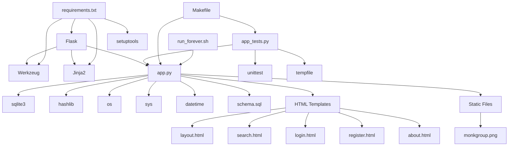

```mermaid
graph TD
    Flask[Flask] --> Werkzeug
    Flask --> Jinja2
    Flask --> app.py
    app.py --> sqlite3
    app.py --> hashlib
    app.py --> os
    app.py --> sys
    app.py --> datetime
    app.py --> schema.sql
    app.py --> templates[HTML Templates]
    templates --> layout.html
    templates --> search.html
    templates --> login.html
    templates --> register.html
    templates --> about.html
    app.py --> static[Static Files]
    static --> monkgroup.png
    app_tests.py --> app.py
    app_tests.py --> unittest
    app_tests.py --> tempfile
    Makefile --> app.py
    Makefile --> app_tests.py
    run_forever.sh --> app.py
    requirements.txt --> Flask
    requirements.txt --> Werkzeug
    requirements.txt --> Jinja2
    requirements.txt --> setuptools
```